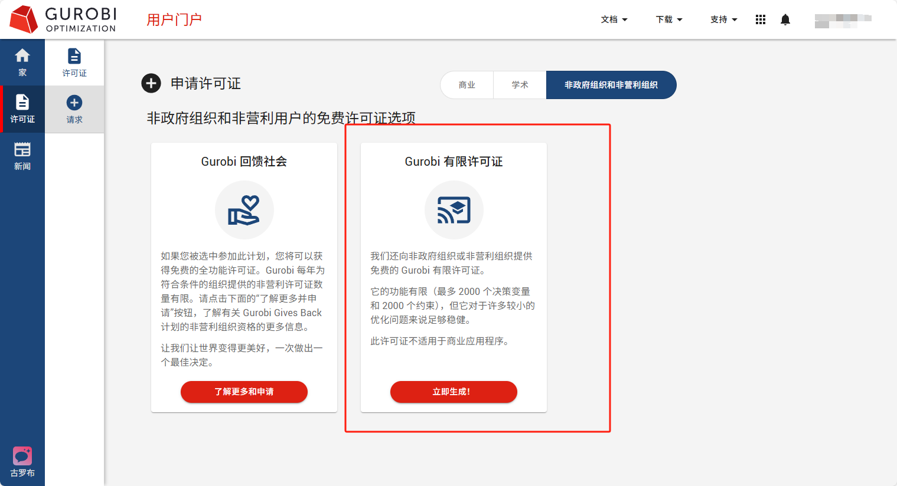

## 使用方法以及结果展示

1. 创建conda环境并激活

2. 安装所用到的库

```bash
pip install -r requirements.txt
```

3. 去到Gurobi官网，下载Gurobi Optimizer，并获取免费许可证

```
下载地址：
https://support.gurobi.com/hc/en-us/articles/4534161999889-How-do-I-install-Gurobi-Optimizer
获取官方免费通行证地址：
https://portal.gurobi.com/iam/login/?target=https%3A%2F%2Fportal.gurobi.com%2Fiam%2Flicenses%2Flist%2F
注册并登入
```





```bash
运行服务
uvicorn main:app --reload
```

对系统进行提问，比如：
```text
你是谁？
```
或者询问专业的调度问题：
```text
额定容量为400MWh，额定功率为100MW，电价预测，对后面24小时的电价预测，时间间隔是30分钟，单位是元/kWh:[0.32, 0.24, 0.24, 0.25, 0.26, 0.3, 0.31, 0.29, 0.32, 0.37, 0.41, 0.44, 0.44, 0.45, 0.46, 0.47, 0.47, 0.47, 0.46, 0.42, 0.35, 0.29, 0.23, 0.24, 0.25, 0.29, 0.29, 0.23, 0.25, 0.22, 0.21, 0.21, 0.2, 0.18, 0.17, 0.16, 0.16, 0.13, 0.12, 0.11, 0.1, 0.1, 0.12, 0.12, 0.12, 0.14, 0.15, 0.17 ],碳价序列：[0.08, 0.08, 0.07, 0.09, 0.08, 0.05, 0.07, 0.06, 0.07, 0.06, 0.07, 0.08, 0.06, 0.06, 0.06, 0.08, 0.07, 0.1, 0.08, 0.09, 0.07, 0.08, 0.07, 0.06, 0.05, 0.09, 0.08, 0.09, 0.1, 0.08, 0.05, 0.09, 0.07, 0.08, 0.08, 0.09, 0.09, 0.07, 0.06, 0.05, 0.06, 0.08, 0.07, 0.09, 0.09, 0.08, 0.06, 0.07]请帮我做一个24小时间隔为0.5小时的决策调度，请给出完整的时间调度计划，并做出总结。

```

#### 设计思路

1. **先自构建2000+数据集，再使用Llama-Factory，进行LoRA微调。**

  据我微调的经验来说吧应该，Qwen3-8B是比较合适的（需要至少16GB，24GB的显存），不用刻意花大量数据去训练它调用工具的能力，就已经可以很好实现了，如果是1.5B这样的参量的，可能需要花多一点的数据去训练模型调用特定工具的能力。

  然后我这边主要训练的是模型的一些关于储能电站知识库，为模型提供一些先验知识，还有一些语言风格使其专业平滑，输出格式比较专业，小数据训练其调用指定工具的能力，关于数据集的构建我采用的是Alpaca风格的，然后可以去找一些相关的文献，然后用AI技术/自动化技术获取其中的知识，以及人工构设计参数智能补全和意图识别的案例，构建指令式数据集，部分调整语言风格可能需要人工标注了，但也可以通过前辈们训练的AI去做这件事情（前人栽树，后人乘凉），也可以用自己之前训练的AI。

2. **根据上一步收集到的准确的资料来构建fassi向量库，并自己构建智能体流和一些约束条件的规则库，后续也可以自己添加**

  因为相对于其他大佬微调的AI来说，我们的数据集还是比较少的，因此呢我们需要用RAG的技术来增强我们模型的知识能力。

3. **工具设计**

  做这种储能电站调度问题，那么如果是让大模型完全的自我决策，自己寻找方法计算经济效益和物理场模型显然是不太现实和精准的，那么我们就需要自己构建一些工具来供大模型使用，比如合适的计算方法，多目标优化模型，来评估这样调度的经济效益，从而可以寻优，找到最好的调度方案。按LLM-Tool的调用机制，这边计算方法采用的是Gurobi数学规划求解器，是一个很优秀的商用求解器，需要自己去官网申请，免费的许可证就够了，如果做超过一天的调度可能需要专业的许可证。

  另外也可以自己集成一些其他的工具，因为我希望这个模型在专业领域上不只是可以用作调度，同样可以用作其他的方面，比如知识问答，根据天气评估一些手段，措施，这样就需要集成一个天气API的工具。


4. **系统开发**

  因为希望快速开发且功能尚未设计完整的业务流程，所以采用了简单的前端三件套 + 后端FastAPI快速本地部署，在Vue3方面比较会调组件库一些，前端三件套实操的还是比较少的，由于是一个人且项目也没那么看重业务就没做前后端分离。

  一个小亮点就是对Markdown语法实现了编译，对表格做出了特殊的样式，以及界面采用了渐变色的形式，下面有实际的展示。
  
https://github.com/user-attachments/assets/7663b182-edd1-4efe-8952-b2016a9c252a

<video src="\AI问答.mp4"></video>
  总结来说项目还是比较完善，由于模型微调模型太大了我就没有上传，各位可以自己操作，总的来说还是用了一个上下文工程的操作，RAG的模式以及结合LoRA微调算是把这些AI技术结合做的一个应用，目前我们也在对专利进行申请，困扰~~~~

  一个小小的结果展示：


  模型还是能比较好的权衡经济收益、寿命、碳排放三目标，能在高抛低购，其中经济收益中也包含了碳交易市场，各种成本的计算（包括基于DoD深度的退化成本），这里只做架构分析，具体计算设计不做过多赘述。

## 软件架构综述
#### 1. 总体架构

本项目是一个基于 FastAPI + LangChain + Gurobi 的智能电池储能调度问答系统，支持网页端可视化交互。系统分为前端（Web UI）、后端（API服务/智能体）、模型优化层和配置层四大部分，采用模块化设计，便于扩展和维护。系统可灵活切换本地大模型推理和云端API推理，兼顾高性能和易用性。


#### 2. 目录结构

```text
AgentWeb/
├── agent.py                # 智能体主逻辑，调度决策与AI问答
├── main.py                 # FastAPI 启动入口，API与网页服务
├── requirements.txt        # 依赖包
├── config/
│   ├── config.py           # LLM配置（本地/云端）
│   ├── create_llm.py       # 本地大模型加载与封装
│   └── llm/
│       └── qwen-Instruct/  # 本地Qwen模型权重与分词器等
├── model/
│   └── battery_decision_model.py # 储能调度优化核心算法
├── templates/
│   └── index.html          # 前端网页（美观聊天界面）
└── ...
```


#### 3. 各模块说明

##### 3.1 前端（templates/index.html）

- 使用原生 HTML+CSS+JS 实现，界面美观现代，支持响应式布局。

- 支持聊天气泡、头像、时间戳、滚动加载、Markdown 渲染等功能。

- 输入区支持多行输入、回车发送、Shift+回车换行。

- 通过 fetch 向后端 /ask 接口发送问题，并实时显示AI回复。


##### 3.2 后端API（main.py）

- 使用 FastAPI 框架，提供 RESTful API。

- / 路由返回前端页面。

- /ask 路由接收用户问题，调用智能体 agent 处理，返回AI答案（支持后续流式输出扩展）。

- 依赖注入 LLM 配置，支持多模型切换。


##### 3.3 智能体与调度决策（agent.py）

- BatterySchedulingAgent 类负责解析用户输入、判断是否需要调用调度工具、参数提取、调用优化器、格式化输出等。

- 支持 LangChain 工具链，能自动调用储能调度决策工具（如用户问题涉及调度/优化/计划等）。

- 具备流式生成能力（可扩展为流式输出，便于前端实时显示）。

- 通过 Pydantic 进行参数校验，保证输入安全与规范。


##### 3.4 优化模型层（model/battery_decision_model.py）

- 基于 Gurobi 求解器实现电池储能站的优化调度。

- 支持多参数建模（容量、功率、SOC、SOH、碳排放、价格等）。

- 采用分段DoD退化建模、日历老化、碳排放约束等多目标（经济性、寿命、碳排放）优化。

- 结果可统计、可格式化输出，便于前端展示。


##### 3.5 配置层（config/config.py & create_llm.py）

- `config.py`  统一管理 LLM 实例，支持两种模式：
  * **API模式：**通过 OpenAI/阿里云 DashScope API 快速推理，适合轻量展示和低配机器。
  * **本地模式：**通过 create_local_qwen_model 加载本地 Qwen-Instruct 大模型，需高性能显卡，推理速度快且数据不出本地。
- `create_llm.py` 封装本地 HuggingFace Qwen 模型的加载、pipeline 构建与 LangChain 适配。


#### 4. 大模型推理方式

##### 4.1 本地大模型（高性能推理）

- 依赖本地 GPU（推荐 24GB 显存及以上）。

- 使用 HuggingFace Transformers 加载 Qwen-Instruct 权重，半精度推理，内存占用低。

- 适合对数据隐私有要求或需高吞吐量的场景。

- 通过 config.py 的 local_llm 实例调用。


##### 4.2 API大模型（云端推理）

- 通过 OpenAI/阿里云 DashScope API 调用大模型，支持流式输出。

- 适合轻量级、快速部署、低配机器或演示场景。

- 通过 config.py 的 llm 实例调用。


##### 4.3 切换方式

- 只需在 agent 初始化时选择 llm（API）或 local_llm（本地）。

- 例如：agent = BatterySchedulingAgent(llm) 或 agent = BatterySchedulingAgent(local_llm)


#### 5. 流式输出支持

- 后端可通过 StreamingResponse 实现流式输出（需 agent 实现 process_query_stream）。

- 前端已预留流式渲染方案（fetch+ReadableStream），可实时显示AI生成内容。


#### 6. 技术栈

##### 6.1 后端

* **FastAPI：** 现代异步Web框架，提供RESTful API和网页服务，支持高性能异步、流式响应。
* **LangChain：**智能体框架，负责大模型与工具链的集成、对话管理、参数抽取等。
* **Transformers (HuggingFace)：**用于本地大模型（如 Qwen-Instruct）的加载与推理。
* **torch (PyTorch)：**本地大模型推理的底层依赖，支持GPU加速。
* **gurobipy：**Gurobi 优化器Python接口，负责储能调度优化的数学建模与求解。
* **langchain_openai / langchain_huggingface：**分别用于API大模型和本地大模型的LangChain适配。

##### 6.2 前端

* **HTML5 + CSS3：**结构与样式，响应式布局，现代化美观设计。
* **原生 JavaScript：**实现聊天交互、流式渲染、Markdown解析、输入框自适应等功能。
* **Markdown 渲染：**支持AI回复内容的格式化展示，包括表格、代码块、列表等。

##### 6.3 其他

* **依赖管理：**通过 `requirements.txt` 管理所有Python依赖包。

* **本地大模型权重：**存放于 `config/llm/qwen-Instruct/`，包含模型、分词器、配置等文件。
* **云端API：**支持调用 OpenAI 或阿里云 DashScope 等大模型API。

##### 6.4 扩展

* **Jupyter Notebook：**便于调试和算法原型开发。
* **Docker：**待定


#### 5. 运行流程

- 大模型：Qwen-Turbo（可扩展OpenAI、GLM等）
- 前端：HTML5、CSS3、原生JS
- 依赖管理：requirements.txt

1. 用户通过网页输入问题，点击发送。

2. 前端将问题POST到 /ask。

3. 后端 FastAPI 接收请求，调用 BatterySchedulingAgent 处理。

4. 智能体判断问题类型，若涉及调度则调用优化模型，否则直接知识问答。

5. 优化模型（Gurobi）计算调度结果，返回格式化文本。

6. 智能体将结果返回API，前端实时显示在聊天框。

7. （可扩展）支持流式输出，前端边生成边显示AI回复。
8. 

#### 6. 特色与可扩展性

- 支持复杂的储能调度优化，参数灵活，约束丰富。

- 智能体具备“理解+决策”能力，能自动区分知识问答与调度请求。

- 前后端解耦，前端美观易用，后端易于扩展流式、SSE、WebSocket等能力。

- 支持多大模型接入，便于后续升级。


#### 7. 架构图

##### 7.1 整体架构图

```text
┌───────────────┐
│   用户浏览器   │
└──────┬────────┘
       │  HTTP(S)请求
       ▼
┌────────────────────────────┐
│         FastAPI后端         │
│ ┌────────────────────────┐ │
│ │   / (网页)             │ │
│ │   /ask (API/流式API)   │ │
│ └──────────┬─────────────┘ │
│            │               │
│            ▼               │
│   ┌────────────────────┐   │
│   │ BatteryScheduling  │   │
│   │   Agent            │   │
│   └───────┬────────────┘   │
│           │                │
│   ┌───────┴────────────┐   │
│   │      LLM选择       │   │
│   │ ┌───────────────┐  │   │
│   │ │  本地大模型   │◄─┼───┤
│   │ │(Qwen/Transformers)│  │
│   │ └───────────────┘  │   │
│   │ ┌───────────────┐  │   │
│   │ │  API大模型    │◄─┼───┤
│   │ │(OpenAI/阿里云)│  │   │
│   │ └───────────────┘  │   │
│   └────────────────────┘   │
│            │               │
│            ▼               │
│   ┌────────────────────┐   │
│   │  储能调度优化模块     │   │
│   │ (Gurobi/数学建模)   │   │
│   └────────────────────┘   │
└────────────────────────────┘
```

##### 7.2 前后端交互流程

```text
用户浏览器
   │
   │ 1. 访问 /
   ▼
FastAPI 返回 index.html
   │
   │ 2. 用户输入问题，点击发送
   ▼
fetch /ask
   │
   │ 3. FastAPI 调用 agent.process_query 或 process_query_stream
   ▼
BatterySchedulingAgent
   │
   │ 4. 选择 LLM（本地/云端），必要时调用调度优化
   ▼
LLM/调度优化
   │
   │ 5. 结果返回 FastAPI
   ▼
FastAPI 返回（流式/完整）结果
   │
   │ 6. 前端渲染气泡，实时展示
   ▼
用户浏览器
```


#### 8. 大模型推理的多阶段运作机理详解

##### 1. 输入结构化（意图识别与参数抽取）

- 目标：将用户的自然语言问题转化为结构化的参数（如调度时间、容量、功率等）。

- 实现：LLM 作为“信息抽取器”，根据预设的 Prompt 或模板，输出 JSON 或参数字典。

- 例如：

用户输入：“我有一个500MWh的储能电站，当前SOC是60%，请制定24小时的充放电策略。”

LLM输出：

```json
 {
   "capacity_kwh": 500000,
   "soc_init": 0.6,
   "time_horizon_hours": 24.0,
  }
```

- 优势：极大提升了系统对复杂自然语言的理解能力，支持灵活多样的用户表达。


##### 2. 数据补全/参数推断

- 目标：自动补全用户未提供但必需的参数，或根据上下文推断合理默认值。

- 实现：LLM 根据已有参数和业务知识，补全如“最大功率”、“时间步长”等。也可结合历史对话、知识库等进行推断。

例如：

用户未说明最大功率，LLM自动补全为默认值100MW。

- 优势：降低用户门槛，提升交互体验，保证后续工具调用的参数完整性。


##### 3. 推理与工具链调用

- 目标：判断是否需要调用外部算法工具（如Gurobi优化器），并生成合适的调用指令。

- 实现：LLM 作为“决策者”，根据结构化参数和业务规则，决定是否调用如 battery_decision_model.py 的优化算法。

- 生成调用参数，驱动算法工具进行求解。

例如：

LLM输出：“请用如下参数调用储能调度优化器……”

- 优势：实现了“AI+工具链”混合智能，既能自然语言推理，又能调用强大的算法工具解决实际问题。


##### 4. 结果规范输出

- 目标：将算法工具返回的原始结果（如原始表格、JSON、代码等）转化为用户友好的自然语言、表格、图表等格式。

- 实现：LLM 作为“结果解释器”，根据预设模板或上下文，将结果转化为易懂的中文描述、Markdown表格、决策摘要等。

例如：

工具返回调度表，LLM输出：“根据您的参数，最佳调度方案如下：……（表格+总结）”

- 优势：极大提升了结果的可读性和专业性，用户无需理解底层算法细节即可获得有用结论。


##### 5. 典型时序图

```text
用户输入
   │
   ▼
[LLM1] 结构化参数抽取
   │
   ▼
[LLM2] 参数补全/推断
   │
   ▼
[LLM3] 工具链推理与调用
   │
   ▼
[算法工具] 求解
   │
   ▼
[LLM4] 结果规范输出
   │
   ▼
用户获得专业、友好的答案
```


------

| 主要模块     | 版本   |
| ------------ | ------ |
| python       | 3.11.0 |
| CUDA         | 11.7   |
| torch        | 2.7.1  |
| langchain    | 0.3.27 |
| transformers | 4.55.0 |

